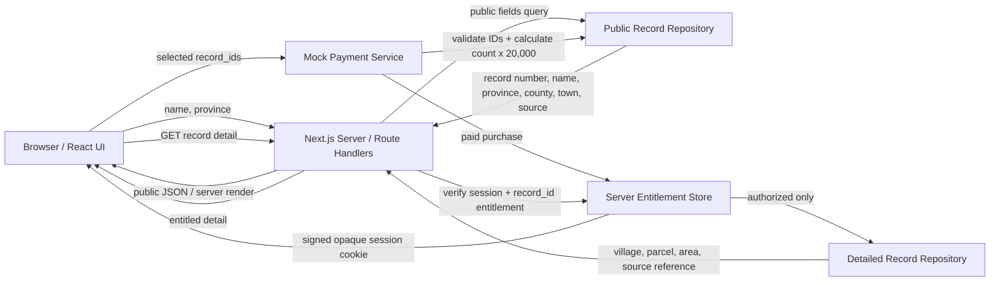

# 조상토지기록 프로토타입 아키텍처

## 1. 설계 목표

이 구조는 다음 두 가지를 동시에 검증하기 위해 설계했다.

1. 성명 무료 검색 → 개별 기록 선택 → 1건당 20,000원 → 선택 기록만 상세 공개라는 사용자 경험
2. 결제 전 상세 토지정보를 클라이언트에 전달하지 않는 서버 권한 경계

Phase 1에서는 Mock Data와 테스트 결제를 사용하지만, UI와 서버 데이터 계층을 분리해 Phase 2에서 Supabase/PostgreSQL과 Toss Payments로 교체할 수 있도록 한다.

## 2. 전체 구조



핵심은 `PublicLandRecord`와 `LandRecordDetail`이 별도 타입이라는 점이다. 무료 화면은 상세 타입을 전달받지 않는다.

## 3. 디렉터리 경계

```text
src/
├─ app/
│  ├─ api/                       # HTTP 경계
│  ├─ search/                    # 공개 검색 UI
│  ├─ checkout/                  # 선택 확인 / 테스트 결제
│  ├─ records/[id]/              # 서버 권한 확인형 상세 페이지
│  ├─ my/                        # 구매 기록 재열람
│  ├─ guide/
│  └─ admin/
├─ components/                   # 브라우저/표현 컴포넌트
├─ lib/                          # 공개 상수, 타입, 포맷, API client
└─ server/                       # server-only 모듈
   ├─ mock-data.ts               # 전체 DEMO 상세 레코드
   ├─ record-repository.ts       # 공개/상세 조회 함수 분리
   ├─ purchase-service.ts        # record_id 검증 + 서버 금액 계산
   ├─ entitlement-token.ts       # 서명 세션 + 서버 메모리 권한
   └─ current-entitlements.ts    # 현재 요청의 서버 세션 조회
```

`src/server` 모듈에는 `server-only` 경계를 적용해 Client Component에서 실수로 import하면 빌드 단계에서 발견할 수 있게 한다.

## 4. 데이터 공개 경계

### 4.1 공개 타입

```ts
type PublicLandRecord = {
  id: string;
  recordNumber: string;
  name: string;
  nameHanja?: string;
  province: string;
  county: string;
  town?: string;
  sourceType: SourceType;
  recordYear?: number;
  isDemo: true;
};
```

### 4.2 구매 후 상세 타입

```ts
type LandRecordDetail = PublicLandRecord & {
  village: string;
  parcelNumber: string;
  exactLocation: string;
  landCategory: string;
  area: string;
  sourceReference: string;
  historicalRegion: string;
  currentRegionMapping: string;
  originalMaterialStatus: string;
};
```

무료 검색 Repository는 `LandRecordDetail`을 `PublicLandRecord`로 명시적으로 변환한다. 직렬화 결과에 상세 키가 존재하지 않으므로 개발자도구, HTML, RSC payload에서 CSS를 해제해 상세정보를 찾을 수 없다.

## 5. API 계약

### `GET /api/search`

Query:

- `name`: 필수
- `province`: 선택
- `page`: 선택

응답:

- 검색어/필터
- 전체 건수, 페이지 정보
- 지역별 건수
- 선택용 공개 record id
- `PublicLandRecord[]`
- DEMO 안내

상세 필드는 포함하지 않는다.

### `GET /api/records/public?ids=...`

Checkout에서 선택 항목을 다시 확인하기 위한 공개 레코드 전용 API다.

- 요청 순서대로 공개 레코드 반환
- 존재하지 않는 id는 `missingIds`로 반환
- 리, 지번, 면적, 출처 상세는 반환하지 않음

### `POST /api/payments/mock`

요청:

```json
{
  "recordIds": ["rec-0001", "rec-0002"]
}
```

서버 처리:

1. 배열 형식 확인
2. 공백과 중복 제거
3. 모든 record_id가 실제 DEMO Repository에 존재하는지 확인
4. 클라이언트 금액을 받지 않고 `recordIds.length * 20000` 계산
5. Mock purchase 생성
6. 서버 세션에 구매 권한 저장
7. 서명된 세션 키를 `httpOnly`, `sameSite=lax` 쿠키로 설정

### `GET /api/records/[id]`

1. 공개 레코드 존재 여부 확인
2. 서버가 세션 쿠키 서명 확인
3. 해당 id가 `unlockedRecordIds`에 있는지 확인
4. 미구매면 403과 공개 레코드만 반환
5. 구매 권한이 있을 때만 상세 Repository 조회 및 응답

### `GET /api/purchases`

현재 DEMO 세션의 구매 내역과 공개 레코드 요약을 반환한다. 구매 내역 재열람용이며 상세 필드는 개별 권한 확인 경로에서만 제공한다.

## 6. 상태 관리

### 선택 상태

- 위치: 브라우저 `localStorage`
- 내용: 사용자가 체크한 공개 `record_id[]`
- 목적: 검색 페이지 이동과 새로고침 사이 선택 유지
- 보안 의미: 없음

선택 목록은 구매 권한이 아니다. 사용자가 localStorage를 임의 수정하더라도 결제 API가 서버에서 record_id를 다시 검증한다.

### 구매 권한 상태

- 위치: Next.js 서버 프로세스의 메모리 Map
- 키: 무작위 session id
- 브라우저 쿠키: `sessionId.HMAC(signature)` 형태의 짧은 불투명 토큰
- 쿠키 속성: `httpOnly`, `sameSite=lax`, Production에서 `secure`

브라우저에는 구매 record_id 전체를 권한 증표로 저장하지 않는다. 이 구조는 Phase 1 전용이며 서버 재시작, 다중 인스턴스, Serverless 확장 환경에서는 영속성과 공유성이 보장되지 않는다.

## 7. 상세 페이지 서버 렌더링

`/records/[id]` Server Component는 다음 순서로 동작한다.

```text
공개 레코드 조회
→ 현재 서버 세션 조회
→ record_id 열람 권한 확인
→ 권한 있음: 상세 레코드 조회 및 출력
→ 권한 없음: 상세 레코드를 조회하지 않고 잠김 안내 출력
```

상세 객체는 Client Component에 전달하지 않는다. 구매 후 상세값은 사용자에게 보여야 하므로 HTML/RSC 응답에 표시되지만, 그 전에 서버 권한 검사를 통과해야 한다.

## 8. Production 전환 설계

### 8.1 Repository 교체

현재:

```text
record-repository.ts → in-memory DEMO_LAND_RECORDS
```

향후:

```text
record-repository.ts 또는 adapter
→ Supabase server client
→ PostgreSQL land_records
```

권장 원칙:

- 무료 검색 select에는 공개 컬럼만 명시
- `select *` 금지
- 이름 exact match 인덱스부터 시작
- 데이터 증가 시 `pg_trgm` 또는 전문 검색 검토
- 상세 조회 쿼리는 사용자 id와 구매권한을 함께 확인

### 8.2 권장 PostgreSQL 모델

```sql
land_records (
  id uuid primary key,
  record_number text not null,
  name text not null,
  name_hanja text,
  province text not null,
  county text not null,
  town text,
  village text,
  parcel_number text,
  land_category text,
  area text,
  record_year integer,
  source_type text not null,
  source_reference text,
  created_at timestamptz not null default now()
);

purchases (
  id uuid primary key,
  user_id uuid not null,
  amount_total integer not null,
  status text not null,
  payment_key text,
  paid_at timestamptz
);

purchase_items (
  id uuid primary key,
  purchase_id uuid not null references purchases(id),
  record_id uuid not null references land_records(id),
  unit_price integer not null check (unit_price = 20000),
  created_at timestamptz not null default now(),
  unique (purchase_id, record_id)
);
```

실제 스키마는 파트너 샘플 데이터를 확인한 뒤 재확정한다.

### 8.3 인증과 권한

- Supabase Auth 또는 Kakao Login 연결
- `purchases.user_id`와 현재 로그인 사용자 일치 확인
- `purchase_items.record_id` 존재 확인
- RLS 정책과 Next.js 서버 검증을 병행
- Service Role Key는 서버에서만 사용

### 8.4 Toss Payments

권장 흐름:

```text
서버 주문 생성
→ 서버가 선택 record_id와 예상금액 저장
→ 브라우저 Toss 결제창
→ 성공 redirect
→ 서버 Toss 승인 API 호출
→ 승인금액과 서버 주문금액 비교
→ DB transaction으로 purchase/purchase_items 확정
→ 상세 열람 권한 활성화
```

클라이언트의 `amount`, `orderName`, 성공 파라미터만으로 권한을 부여하지 않는다. Toss 서버 승인 성공과 서버 보관 주문을 대조해야 한다.

### 8.5 Vercel

- Preview와 Production 환경변수를 분리
- 서버 메모리 Entitlement Store를 배포 전에 제거
- Supabase 연결을 사용해 모든 인스턴스가 같은 구매 상태를 조회
- 결제 API와 상세 API는 `no-store`
- 로그에 개인정보·전체 지번·결제 비밀키를 남기지 않음

## 9. 위협 모델과 방어

| 위험 | Phase 1 방어 | Production 보강 |
| --- | --- | --- |
| CSS 해제/DOM 검사 | 무료 응답에 상세 필드 없음 | 동일 원칙 유지 |
| localStorage record_id 조작 | 결제 API가 ID 존재 여부 재검증 | 사용자·주문·DB transaction 검증 |
| 클라이언트 금액 조작 | 서버가 건수 × 20,000원 재계산 | Toss 승인금액과 DB 주문금액 대조 |
| 세션 쿠키 위조 | HMAC 서명, timing-safe 비교 | 인증 세션/JWT + DB 권한 |
| 다른 기록 URL 직접 접근 | record_id별 서버 권한 확인 | RLS + 서버 권한 이중 확인 |
| 서버 재시작 후 구매 소실 | DEMO 한계로 명시 | PostgreSQL 영구 저장 |
| 다중 Vercel 인스턴스 불일치 | DEMO 배포 한계로 명시 | 공유 DB 사용 |

## 10. 검증 체크리스트

- [ ] `김동현` 검색 결과가 113건인지 확인
- [ ] 무료 검색 JSON에 `village`, `parcelNumber`, `area`, `sourceReference`가 없는지 확인
- [ ] 0건 선택 시 CTA가 비활성화되는지 확인
- [ ] 1건/2건/3건이 각각 20,000원/40,000원/60,000원인지 확인
- [ ] 선택 전체/해제와 지역 필터가 동작하는지 확인
- [ ] Checkout에서 공개 필드만 표시되는지 확인
- [ ] 테스트 결제 요청에 임의의 id를 넣으면 거부되는지 확인
- [ ] 미구매 `/api/records/[id]`가 403인지 확인
- [ ] 구매하지 않은 다른 record_id가 계속 잠겨 있는지 확인
- [ ] 구매한 record_id만 상세 페이지가 열리는지 확인
- [ ] `npm run lint`, `npm run typecheck`, `npm run build` 통과 확인
